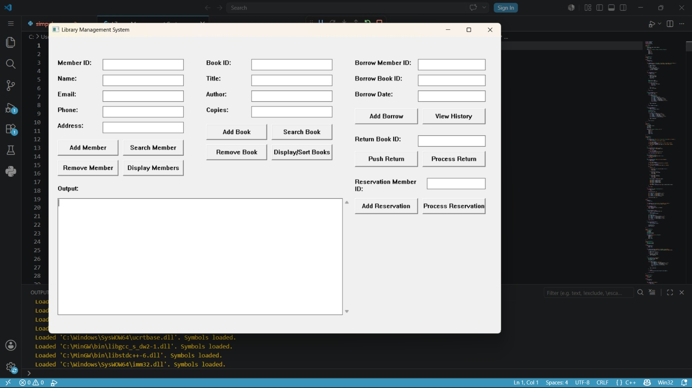

# 📚 Library Management System

A simple **Library Management System** developed using **C++**. This project demonstrates the fundamentals of Object-Oriented Programming (OOP), Linked Lists, and dynamic memory management while implementing basic library member management operations.

---

## 📖 Overview

The Library Management System is a desktop application built in **C++** that allows users to manage library members efficiently. It was developed as an educational project to practice data structures, object-oriented programming concepts, and memory management.

---

## ✨ Features

- ➕ Add new members
- ❌ Remove existing members
- 👤 Store member information
- 🔗 Linked List implementation
- 🧩 Object-Oriented Programming (OOP)
- 🖥 Windows desktop application

---

## 🛠 Technologies Used

- C++
- Windows API (`windows.h`)
- Object-Oriented Programming (OOP)

---

## 📂 Project Structure

```text
library-management-system-cpp/
│── Library Management System.cpp
│── library-management-system.png.jpeg
└── README.md
```

---

## 🚀 Getting Started

Clone the repository:

```bash
git clone https://github.com/mostafa-hashem-zayed/library-management-system-cpp.git
```

Compile the source code:

```bash
g++ "Library Management System.cpp" -o LibraryManagementSystem
```

Run the application:

```bash
./LibraryManagementSystem
```

---

## 📸 Screenshot



---

## 📚 Concepts Used

- Classes & Objects
- Linked Lists
- Dynamic Memory Allocation
- Functions
- Object-Oriented Programming

---

## 🔮 Future Improvements

- Add book management
- Borrow and return books
- Search books
- File storage
- Database support
- Better graphical interface

---

## 👨‍💻 Development

This project was developed collaboratively by **Mostafa Mohamed** and **Marwan Hazem**.

The project focuses on applying Object-Oriented Programming concepts and data structures through a practical desktop application.

---

## 👥 Authors

### Mostafa Mohamed
GitHub: https://github.com/mostafa-hashem-zayed

### Marwan Hazem
GitHub: https://github.com/marwanhazem127-lab

---

## 📄 License

This project was created for educational purposes.

---

⭐ If you found this project useful, consider giving it a star on GitHub!
